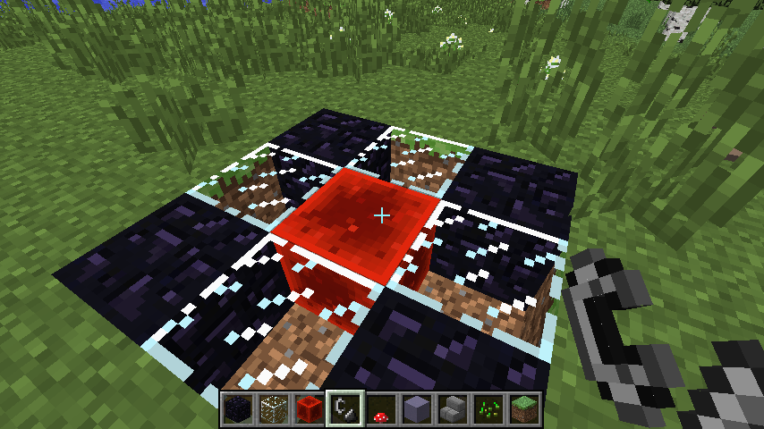
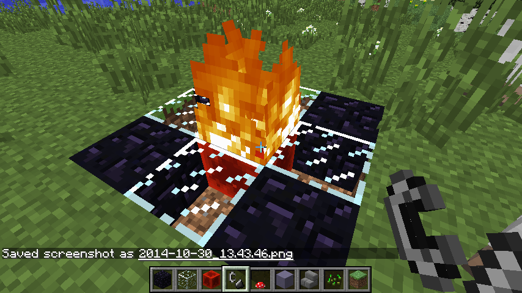
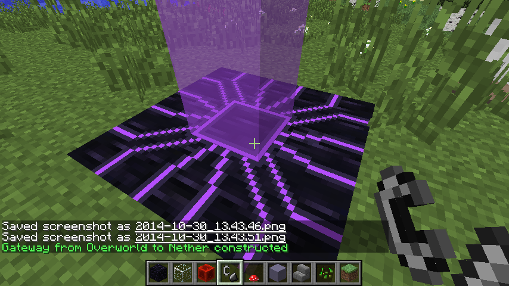
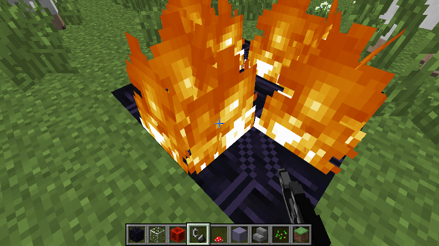
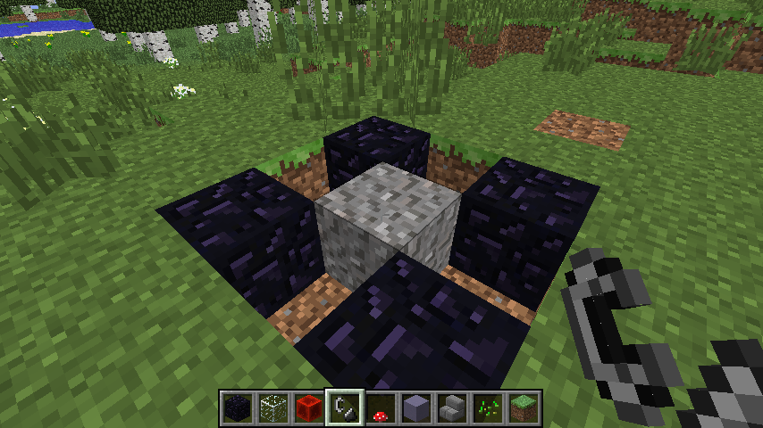

## Overview

Portals, or gateways, created with this mod, have several properties making them a better alternative to vanilla portals
* They work from any dimension. This means you can establish gateway not only from overworld, but also from End, ExtraUtils' Deep Dark, Mystcraft ages and so on. All will lead to Nether equally.
* Gateways are completely indestructible. Even such nasty beasts as Enderdragon and Wither won't do any harm to that structure. Only its owner, the person who created gateway, can remove it via special means
* Gateways support teleporting of mounts and riders at the same moment
* Any entities coming through gateway will maintain their direction and momentum
* Exit location is perfectly predictable. This, along with previous property, means that you'll have no trouble establishing minecart tracks
* Transport cooldown is around 4 seconds. It actually exists just to prevent item entities infini-jumping
* No stupid zombie pigmen spawning

Though this comes at the cost of some limitations

* You cannot construct gateway from Nether, since Nether is used as inter-dimensional travel hub
* Gateway exits in Nether can't be adjacent to each other. Actually, their cores will always have their X and Z differ by at least 8. This doesn't mean their entrances in Overworld should have at least 64 blocks in-between, since there's a deviation in exit positions. See [Exit search algorithm](#exit-search-algorithm) for details. This limitation also means that gateways from different dimensions might conflict for exit location. Place with care.
* Unlike with vanilla portals, their construction isn't cost-free. You won't get back all the materials 

## Getting started

To construct your first gateway, you'll need:

0. Place multiblock platform, 3x3, consisting of 4 obsidian, 4 glass and 1 redstone block 
0. Ignite redstone block in center with flint'n'steel 
0. Construct will transform into gateway almost instantly 

There's an option which allows to adjust exit location. See [Anchors](#anchors)

## Removal

Only owner is allowed to remove gateway.
To do so, you need to light 4 blocks directly adjacent to central pillar with flint'n'steel. All 4 blocks must be lit by the owner, otherwise the trick won't work

Not all initial blocks would survive procedure. Only obsidian is strong enough to return. Glass shatters to nothing due to high flux. And redstone burns down to gravel, becoming useless

On the other side, all blocks removed by exit construction will return onto their places like nothing has happened. So you'll see no traces of gateway.

## Exit search algorithm

0. Exit location pivot is found. Its X and Z are source gateway's ones, adjusted by worlds' movement factors. For Overworld-Nether pair, they're effectively divided by 8
0. Lookup volume around pivot is scanned. Lookup volume is between (X - 5, 32, Z - 5) and (X + 5, 96, Z + 5)
0. Each block in lookup volume is classified by being ordinary solid block, liquid, air, etc.
0. If other gateway is found in vicinity, all blocks in its dead zone (which is a column spanning from top to bottom) are marked as invalid, and prevent other gateway from spawning
0. Then, all possible positions are rated by their weights. The less weight, the better
  * Each non-air block above future platform adds to weight, as it needs to be removed
  * Each non-solid block in place of future platofrm adds to weight, as it needs to be replaced with solid platform block
  * Any liquid in near vicinity (lava in case of Nether) completely prevents gateway from spawning. This vicinity is a volume between (cx - 3, cy, cz - 3) and (cx + 3, cy + 4, cz + 3). This countermeasure should prevent gateway exit from pouring unsuspecting player into lava
  * Any blocks in direct gateway's volume, which have tile entities, prevent it from open, because they're stored in process
  * Distance from lookup volume center also adds to weight

Player can adjust exit location by using

### Anchors

Anchor is just a block of redstone placed somewhere in lookup volume. If exit search algorithm finds one, it would prefer that block position above all others. Please note that there should be only one anchor, otherwise gateway won't open. Also, if you close gateway, you'll get your anchor back.
